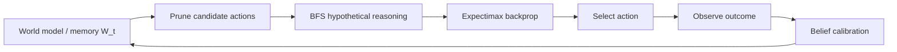

<!--
README 目标：清晰、可复现、易导航。
不在 README 中虚构许可证/基准结果/论文信息；如需可由维护者补充。
-->

# Hypothetical Reasoning Agent Framework

这是一个统一的实验框架，用于评估 LLM Agent 在复杂多智能体社会模拟中的决策表现。核心思想是：将历史交互经验转化为面向未来的策略洞察，并通过“假设推理（Hypothetical Reasoning）”在候选行动空间中进行规划与校准。

<p align="center">
    <a href="#quick-start">Quick Start</a> ·
    <a href="#diplomacy-tournament">Diplomacy</a> ·
    <a href="#delivery-rider-social-involution">Delivery Simulation</a> ·
    <a href="#reproducibility">Reproducibility</a>
</p>

<p align="center">
    
    
    
</p>


---

## 目录

- [Hypothetical Reasoning Agent Framework](#hypothetical-reasoning-agent-framework)
  - [目录](#目录)
  - [Quick Start](#quick-start)
  - [特性](#特性)
  - [核心架构](#核心架构)
  - [实验场景](#实验场景)
    - [Diplomacy Tournament](#diplomacy-tournament)
    - [Delivery Rider Social Involution](#delivery-rider-social-involution)
  - [安装](#安装)
    - [环境要求](#环境要求)
    - [安装步骤](#安装步骤)
  - [LLM 配置](#llm-配置)
    - [DashScope（Qwen，OpenAI compatible）](#dashscopeqwenopenai-compatible)
    - [OpenAI Compatible Endpoints（本地/代理）](#openai-compatible-endpoints本地代理)
  - [Reproducibility](#reproducibility)
  - [项目结构](#项目结构)
  - [扩展指南](#扩展指南)

---

## Quick Start

> 默认入口：Diplomacy Tournament（包含 RQ2 / RQ3 / RQ4 的输出）。

```bash
python run_diplomacy.py
```

如果需要不同运行模式（多模型对比 / 消融等），请查看下方 [Diplomacy Tournament](#diplomacy-tournament) 的 `RUN_MODE` 说明。

---

## 特性

- **统一实验框架**：同一套日志/评估/可视化脚本可复用到多个场景。
- **可插拔 Agent**：核心方法与多个 baseline 实现在同一目录与 runner 下对齐。
- **结构化输出**：实验结果自动落盘到 `experiments/`，便于复现实验与横向对比。

---

## 核心架构

核心方法 Agent 采用四阶段 OODA 风格闭环决策流水线：

1. **World Model Construction**：维护交互历史 $W_t = \{(a, f, r, e)\}^{t-1}$，并用 Laplace smoothing 初始化非信息先验。
2. **Candidate Action Pruning**：通过 LLM 引导的启发式过滤压缩动作空间：
     $A_{\text{cand}} = \text{LLM}_{\text{filter}}(A_{\text{raw}}, W_t, G_{\text{meta}})$
3. **Hypothetical Reasoning via BFS**：分层 BFS 扩展 + Top-K 分支 + Expectimax 回传。
4. **Dynamic Belief Calibration**：执行后用观测更新信念，结合语义总结与频率校准。

下面是一个便于读者快速“抓住流程”的高层示意图：



---

## 实验场景

### Diplomacy Tournament

位置：`simulation/diplomacy/`

基于经典桌游 Diplomacy（no-press）。核心方法 Agent（England）与多个 baseline agent 在多局、多轮环境下对战。

**Baseline Methods**

| Baseline | Core Mechanism | Characteristics |
|---|---|---|
| **ReAct** | Reasoning + Acting（短上下文） | 战术敏捷但易短视 |
| **Reflexion** | Actor + Reflector（反思学习） | 从失败中抽取经验 |
| **LATS** | Language Agent Tree Search | 规划与行动一体 |
| **Hypothetical Minds** | Theory of Mind + Mental simulation | 建模对手意图并模拟回应 |

**运行方式**

```bash
python run_diplomacy.py
```

支持通过环境变量 `RUN_MODE` 选择运行模式：

- `RQ3`：单配置 tournament
- `RQ3_MODELS`：多模型组对比（示例：gpt-4o / gpt-5 / glm-4.5）
- `RQ4`：消融实验（Full / w/o Observe / w/o Orient / w/o Decide / w/o All）

> 说明：具体有哪些模型/消融项，以代码中枚举为准（README 不在此处硬编码以避免与实现漂移）。

**输出文件**（保存到 `experiments/diplomacy_tournament_*/`）

- `RQ2_Evolution.csv`：逐轮预测准确率演化
- `RQ3_Performance.csv`：胜率与对局结果
- `RQ4_Ablation.csv`：消融汇总
- `Turn_Log.csv`：逐回合详细日志

---

### Delivery Rider Social Involution

位置：`simulation/SocialInvolution/`

模拟外卖平台上的骑手工时决策与订单派发策略，在竞争环境中研究不同决策框架的适应性博弈行为。

**支持的决策框架**（通过 `SociologyAgent` 适配）

| Framework | Mixin Class | Description |
|---|---|---|
| **OODA + BFS（核心方法）** | `RiderLLMAgent` | OODA + BFS Expectimax |
| **ReAct** | `RiderReActAgent` | 短上下文推理 |
| **LATS** | `RiderLATSAgent` | 语言引导树搜索 |
| **Hypothetical Minds** | `RiderHypotheticalMinds` | ToM 竞争建模 |
| **Greedy Heuristic** | `RiderGreedyHeuristic` | 非 LLM 贪心启发式 |

骑手实体 `Rider` 可通过继承相应 Mixin 切换决策框架。

---

## 安装

### 环境要求

- Python 3.10+
- （可选）CUDA 兼容 GPU：用于本地大模型推理或加速

### 安装步骤

```bash
# Create virtual environment
python -m venv .venv

# Activate (Windows PowerShell)
.venv\Scripts\Activate.ps1

# Install deps
pip install -r requirements.txt
```

---

## LLM 配置

通过环境变量配置 LLM 后端：

### DashScope（Qwen，OpenAI compatible）

Windows PowerShell：

```powershell
setx DASHSCOPE_API_KEY "your_key"
setx DASHSCOPE_BASE_URL "https://dashscope.aliyuncs.com/compatible-mode/v1"
```

### OpenAI Compatible Endpoints（本地/代理）

Windows PowerShell：

```powershell
setx OPENAI_API_KEY "your_key"
setx OPENAI_BASE_URL "http://localhost:8500/v1"
```

> 提示：`setx` 写入用户环境变量后，需要重新打开终端/VS Code 才会生效；如果你希望仅对当前会话生效，可以用 `$env:OPENAI_API_KEY="..."` 形式。

---

## Reproducibility

- 所有实验输出默认写入 `experiments/` 并按时间戳创建新目录（便于复现实验与对比）。
- 建议在发布结果时记录：代码版本（commit hash）、`requirements.txt`、使用的模型/后端与关键环境变量。
- 若你在 Windows 上运行，建议使用 PowerShell 并确保虚拟环境已激活。

---

## 项目结构

```
project_root/
├── run_diplomacy.py                  # Diplomacy tournament entry point
├── main.py                           # Auxiliary entry point
├── requirements.txt                  # Python dependencies
│
├── agents/                           # Agent implementations
│   ├── rise_agent.py                 # Core agent (OODA loop + BFS Expectimax reasoning)
│   ├── diplomacy_baselines.py        # Diplomacy baseline agents
│   ├── hypothetical_minds_agent.py   # Independent Hypothetical Minds Agent
│   ├── ReActAgent.py                 # Independent ReAct reasoning agent
│   ├── LATSAgent.py                  # Independent LATS agent
│   └── __pycache__/
│
├── simulation/                       # Simulation scenarios and core models
│   ├── diplomacy/                    # Diplomacy tournament
│   │   └── tournament.py             # Tournament runner
│   ├── SocialInvolution/             # Delivery rider social involution simulation
│   │   ├── algorithm/                # Order generation algorithms
│   │   │   ├── generate_orders.py
│   │   │   └── order_sequence.py
│   │   ├── config/                   # Rider configuration files
│   │   └── entity/                   # Simulation entities
│   │       ├── city.py
│   │       ├── meituan.py
│   │       ├── merchant.py
│   │       ├── order.py
│   │       ├── rider.py
│   │       └── user.py
│   └── models/                       # Shared model components
│       ├── agents/                   # Agent base abstractions
│       │   ├── LLMAgent.py           # LLM wrappers (OpenAI/DashScope/Ollama)
│       │   ├── GameAgent.py          # Game agent base class
│       │   └── SociologyAgent.py     # Sociology simulation adapter
│       └── cognitive/                # Cognitive model components
│           ├── cognitive_agent.py
│           ├── agent_profile.py
│           ├── hypothesis_reasoning.py
│           ├── world_cognition.py
│           ├── country_strategy.py
│           ├── evaluation_system.py
│           ├── experiment_logger.py
│           └── realtime_hooks.py
│
├── visualize/                        # Visualization scripts
│   ├── delivery_rq2.py
│   ├── diplomacy_rq2_plot.py
│   ├── bar_chart.py
│   ├── radar_chart.py
│   ├── radar_2_chart.py
│   ├── line_chart-evo.py
│   └── line_chart-history.py
│
└── experiments/                      # Auto-generated experiment outputs
    ├── diplomacy_tournament_*/
    └── unified_comparison_*/
```

---

## 扩展指南

| Goal | Method |
|------|------|
| Add New Diplomacy Baseline | Inherit `_LLMBaselineBase` in `agents/diplomacy_baselines.py`, register in `tournament.py`'s `BASELINE_TYPES` |
| Add New Delivery Baseline | Implement Rider Mixin in `simulation/models/agents/SociologyAgent.py` |
| Add New Evaluation Metrics | Extend `simulation/models/cognitive/evaluation_system.py` |
| New Simulation Scenarios | Create a new directory under `simulation/`, implement `ScenarioAdapter` |
| Custom Visualizations | Add scripts in `visualize/` |

